<div align="center">

# 🖥️ IT Equipment Complaint Management System

**A full-lifecycle Java Swing desktop application for university IT complaint management**  
*Built end-to-end: Requirements → SRS → UML Design → Object-Oriented Implementation*


**Course:** Software Design & Analysis (SDA) · FAST NUCES Peshawar · 2026

</div>

---

## 📌 Overview

The **IT Equipment Complaint Management System** is a role-based desktop application that digitizes the process of reporting, tracking, and resolving faulty IT equipment at a university. The system supports four distinct user roles — **User, IT Staff, Technician, and Admin** — each with a dedicated dashboard and tailored functionality.

This project was developed following a complete **software engineering pipeline**: from requirement elicitation and SRS documentation through UML design (use case and class diagrams) to a fully working Java Swing implementation. Every functional requirement is traced to a working feature.

> Built for the Software Design & Analysis course as a team project demonstrating mastery of OOP design principles, UML-to-code mapping, and desktop GUI development.

---

## ✨ Features

### 👤 User
- Secure registration and role-based login
- Submit IT equipment complaints with type, description, location, and image path
- Auto-generated unique complaint ticket IDs
- Real-time complaint status tracking
- Submit post-resolution feedback with a star rating

### 🛠️ IT Staff
- View and manage the complete complaint queue
- Assign complaints to available technicians
- Mark complaints as resolved once work is confirmed

### 🔧 Technician
- View personal queue of assigned complaints
- Update repair status at each stage
- Add detailed repair notes visible to the user

### 🛡️ Admin
- Full user account management (view, delete)
- Remove invalid or duplicate complaints
- Generate complaint reports with statistics and summaries

---

## 🏗️ Architecture

The project was built following a structured software engineering lifecycle:

```
Requirements Gathering
        ↓
SRS Documentation (20 Functional Requirements)
        ↓
UML Design (Use Case Diagram + Class Diagram)
        ↓
Java Implementation (UML-to-Code Mapping)
        ↓
Swing GUI (Role-Based Dashboards)
```

### Package Structure

```
com.itcms/
├── model/      →  User, Admin, ITStaff, Technician,
│                  Complaint, Equipment, Feedback,
│                  Notification, Report
├── service/    →  DataStore.java  (Singleton in-memory database)
├── ui/         →  LoginFrame, RegisterFrame, BaseDashboard,
│                  UserDashboard, ITStaffDashboard,
│                  TechnicianDashboard, AdminDashboard
└── util/       →  UITheme.java  (dark theme, fonts, reusable components)
```

---

## 🎨 Design Patterns & OOP Concepts

| Concept | Application |
|---|---|
| **Singleton** | `DataStore` — single shared in-memory database instance |
| **Inheritance** | `Admin`, `ITStaff`, `Technician` all extend the base `User` class |
| **Abstract Class** | `BaseDashboard` — shared structure for all role-specific dashboards |
| **Encapsulation** | Private fields with controlled access across all model classes |
| **Association** | `Complaint` is linked to a submitting `User` and assigned `Equipment` |
| **Aggregation** | `Report` aggregates multiple `Complaint` objects |
| **Role-Based Access Control** | Each role sees only its own dashboard and permitted actions |
| **UML-to-Code Mapping** | Class diagram directly translated into Java class hierarchy |

---

## 📐 UML Design

<table>
<tr>
<td align="center" width="50%">

**Use Case Diagram**
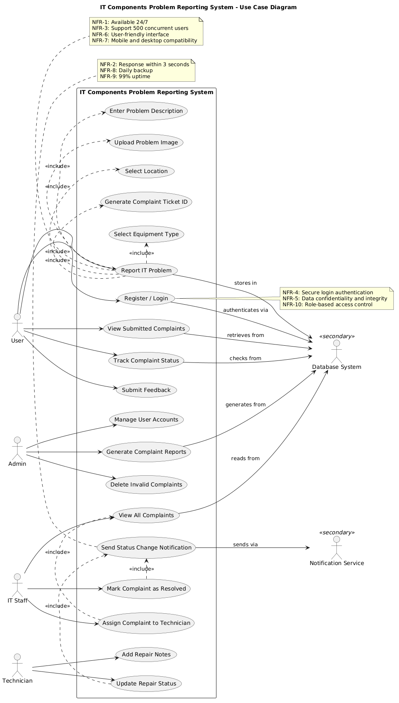

</td>
<td align="center" width="50%">

**Class Diagram**
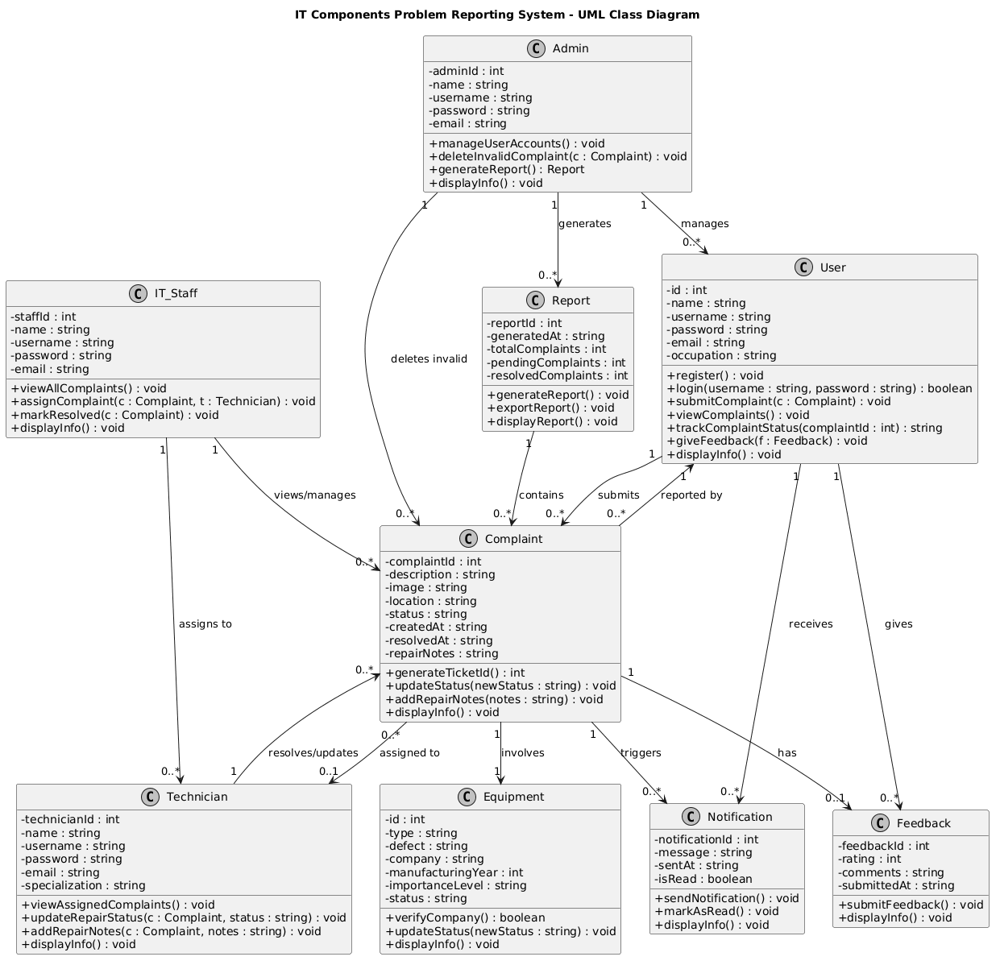

</td>
</tr>
</table>

> Full SRS and design documentation available at [`docs/IT EQUIPMENT COMPLAINT MANAGEMENT SYSTEM.pdf`](docs/IT%20EQUIPMENT%20COMPLAINT%20MANAGEMENT%20SYSTEM.pdf)

---

## 🖼️ Screenshots

<table>
<tr>
<td align="center">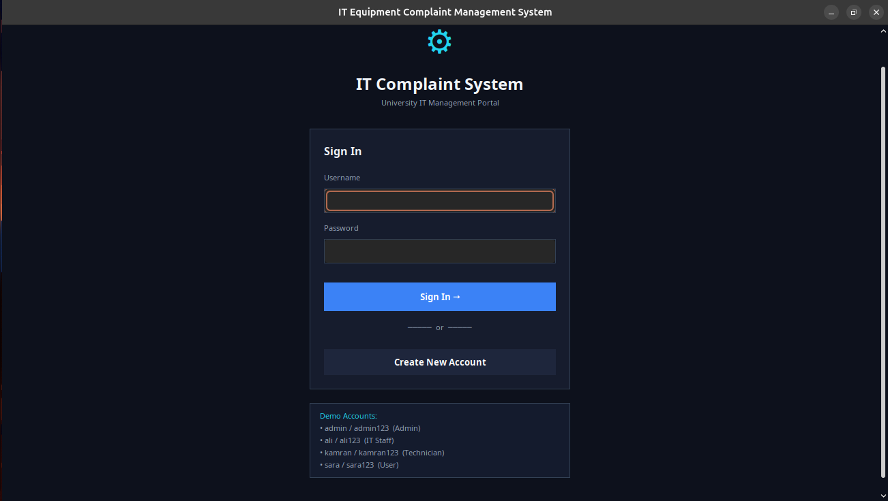</td>
<td align="center">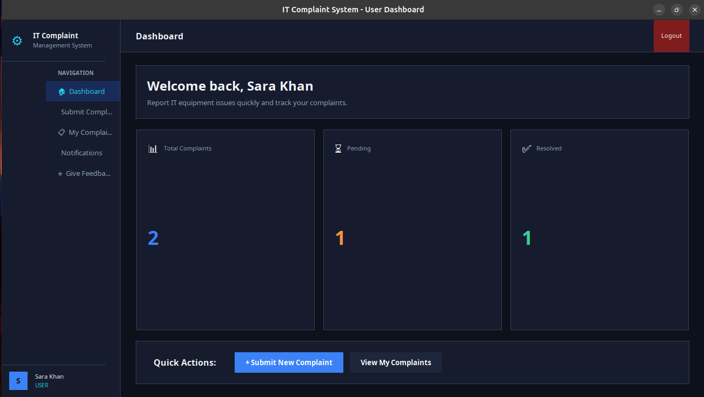</td>
<td align="center">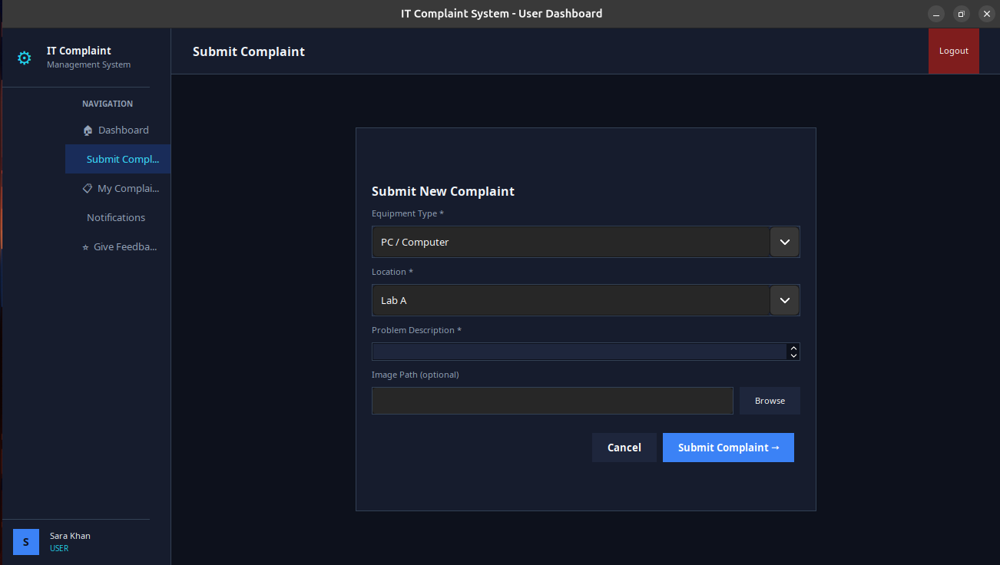</td>
</tr>
<tr>
<td align="center">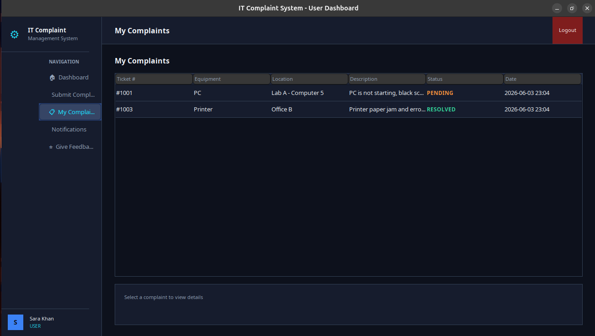</td>
<td align="center">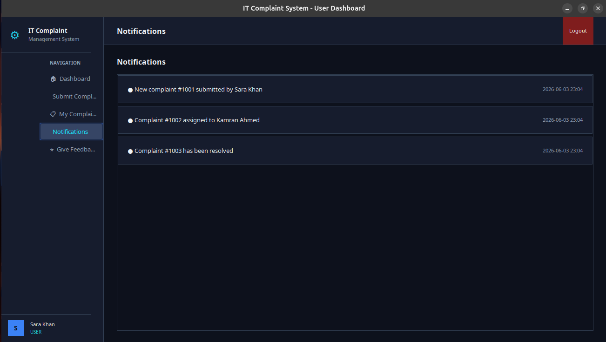</td>
<td align="center">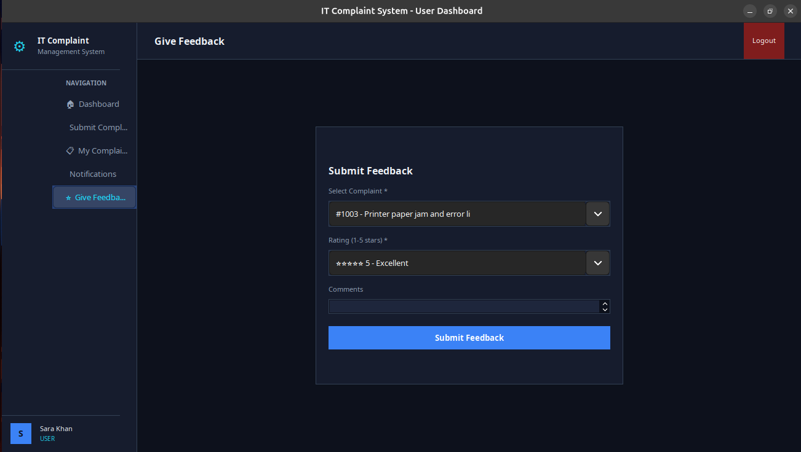</td>
</tr>
<tr>
<td align="center">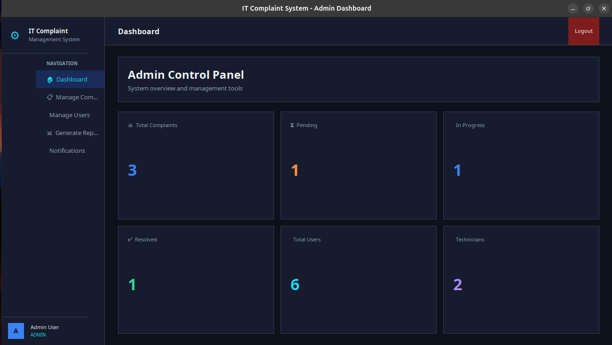</td>
<td align="center">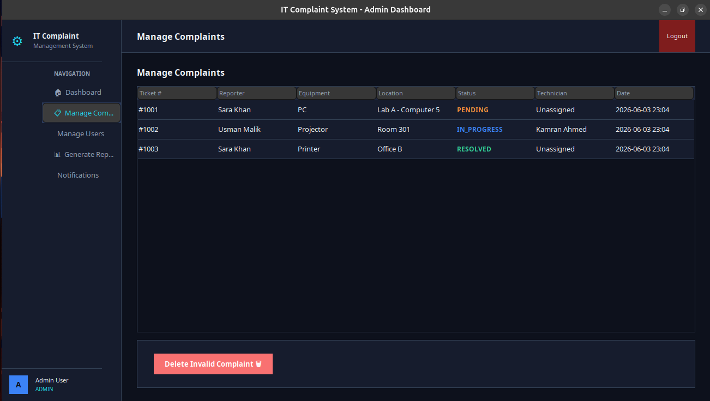</td>
<td align="center">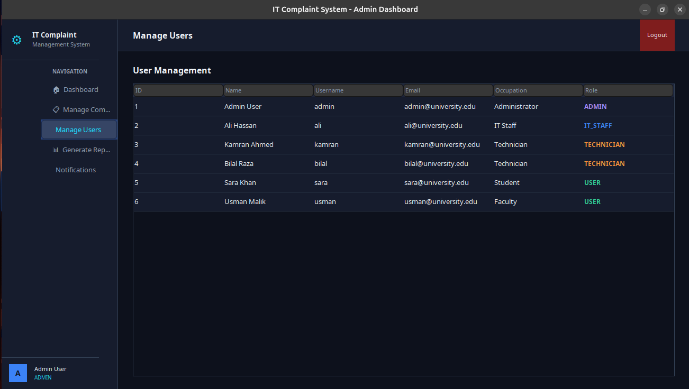</td>
</tr>
<tr>
<td align="center">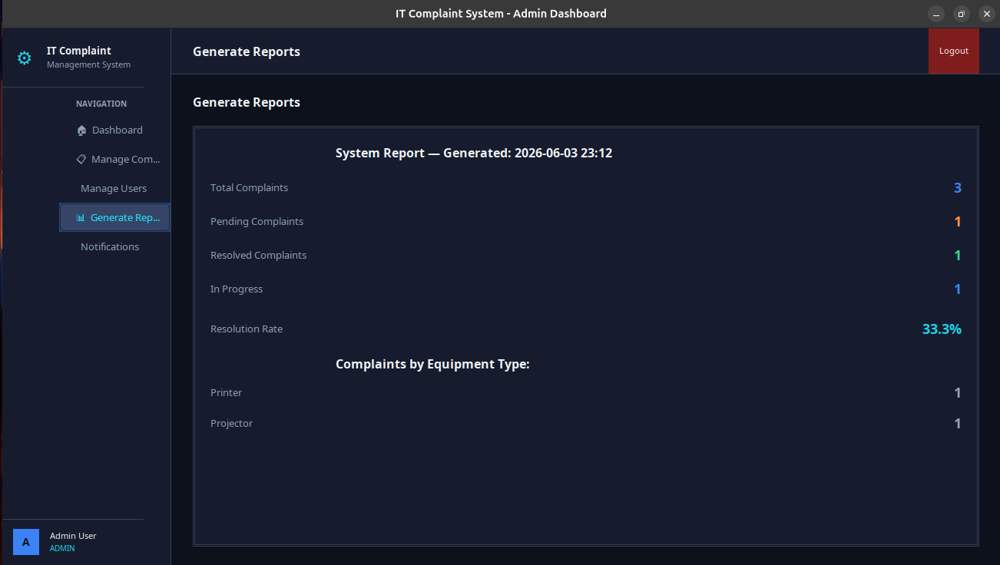</td>
<td align="center">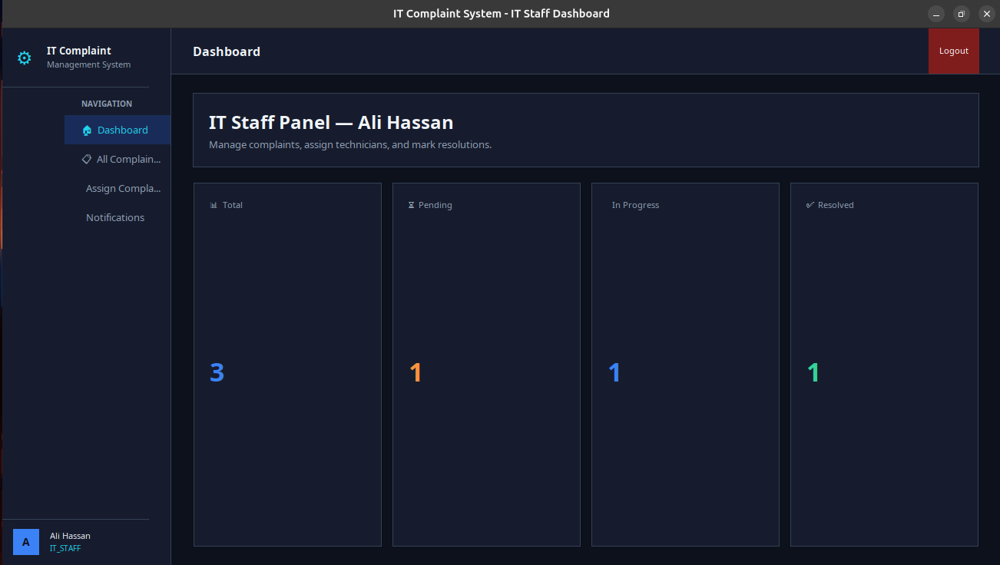</td>
<td align="center">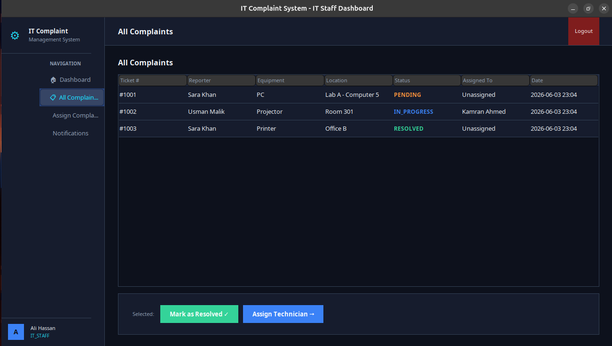</td>
</tr>
<tr>
<td align="center">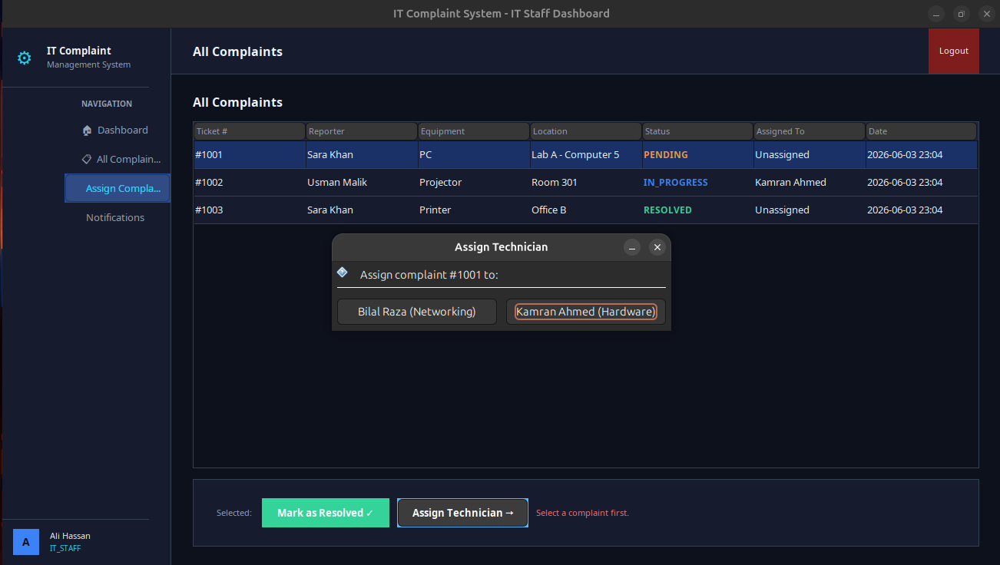</td>
<td align="center">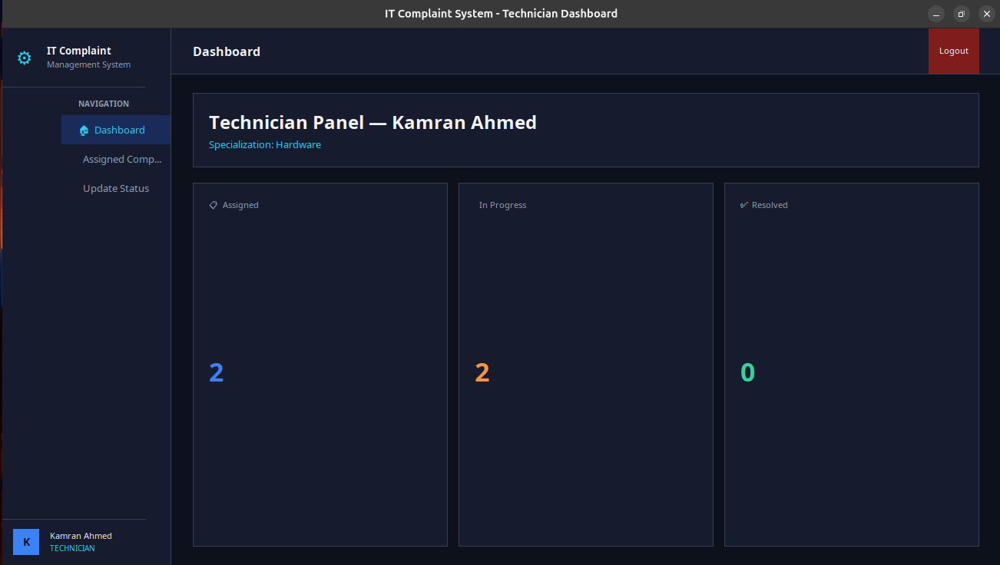</td>
<td align="center">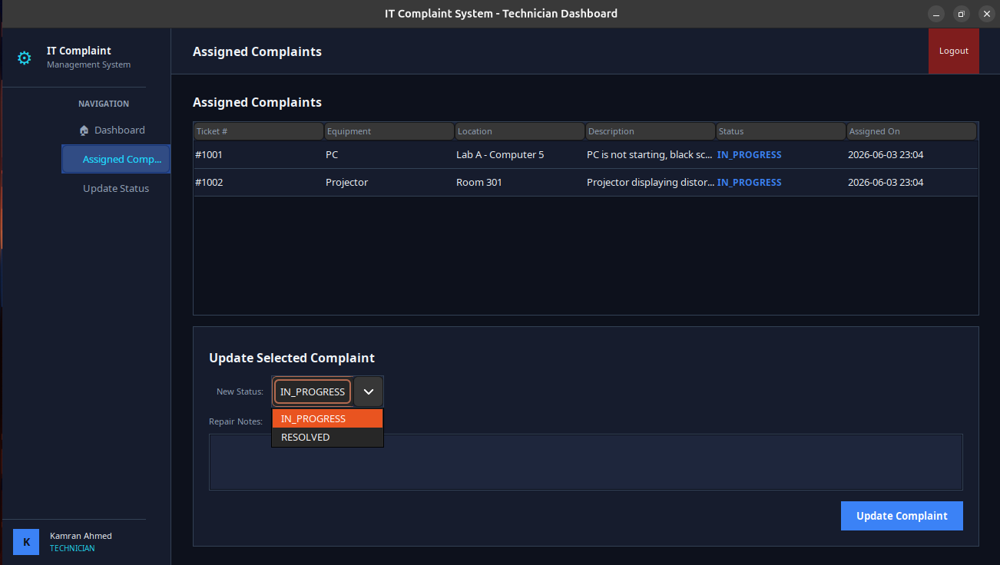</td>
</tr>
</table>

---

## 🚀 Getting Started

### Prerequisites

- Java 8 or higher installed
- Verify with: `java -version`

---

### ⚡ Option 1 — Run the Pre-Built JAR (Recommended)

No compilation required. Download the latest release and run directly.

1. Go to the [**Releases**](../../releases) tab on this repository
2. Download `ITComplaintSystem.jar`
3. Run it:

```bash
java -jar ITComplaintSystem.jar
```

> This is the fastest way to try the application with zero setup.

---

### 🛠️ Option 2 — Compile from Source

```bash
# 1. Clone the repository
git clone https://github.com/your-username/ITComplaintSystem.git
cd ITComplaintSystem

# 2. Compile all source files
javac -d out $(find src -name "*.java")

# 3. Run the application
java -cp out com.itcms.Main
```

---

## 🔑 Demo Accounts

Use these credentials to explore all roles without registration:

| Username | Password | Role |
|---|---|---|
| `admin` | `admin123` | Admin |
| `ali` | `ali123` | IT Staff |
| `kamran` | `kamran123` | Technician |
| `sara` | `sara123` | User |

---

## ✅ Functional Requirements Coverage

All 20 functional requirements from the SRS are implemented and verified:

| ID | Requirement | Status |
|---|---|---|
| FR-01 | User Registration | ✅ |
| FR-02 | User Login with role detection | ✅ |
| FR-03 | Submit complaint — equipment type | ✅ |
| FR-04 | Submit complaint — description | ✅ |
| FR-05 | Submit complaint — location | ✅ |
| FR-06 | Submit complaint — image path | ✅ |
| FR-07 | Form validation on complaint submission | ✅ |
| FR-08 | Auto-generate complaint ticket ID | ✅ |
| FR-09 | In-memory data storage via DataStore singleton | ✅ |
| FR-10 | User views own complaints | ✅ |
| FR-11 | User tracks real-time complaint status | ✅ |
| FR-12 | IT Staff views all submitted complaints | ✅ |
| FR-13 | IT Staff assigns complaints to technicians | ✅ |
| FR-14 | Technician views assigned complaints | ✅ |
| FR-15 | Technician updates repair status | ✅ |
| FR-16 | Technician adds repair notes | ✅ |
| FR-17 | IT Staff marks complaints as resolved | ✅ |
| FR-18 | User submits feedback with star rating | ✅ |
| FR-19 | Admin manages user accounts | ✅ |
| FR-20 | Admin generates complaint reports and statistics | ✅ |

---

## 📂 Repository Structure

```
ITComplaintSystem/
├── src/
│   └── com/itcms/
│       ├── model/
│       ├── service/
│       ├── ui/
│       └── util/
├── docs/
│   ├── IT EQUIPMENT COMPLAINT MANAGEMENT SYSTEM.pdf
│   ├── class-diagram.png
│   ├── use-case.png
│   └── screenshots/
│       ├── it-1.png  →  it-15.png
├── ITComplaintSystem.jar
└── README.md
```

---

## 📚 Learning Outcomes

Through this project, the team applied and demonstrated:

- Translating stakeholder requirements into a formal **Software Requirements Specification (SRS)**
- Producing **UML Use Case and Class Diagrams** that directly drove implementation
- Applying core **OOP principles** — inheritance, encapsulation, abstraction, polymorphism — in a real system
- Implementing the **Singleton design pattern** for centralized state management
- Designing and building a **role-based access control** system from scratch
- Building a multi-screen **Java Swing GUI** with consistent theming and component reuse
- Practicing **team-based software development** with clear separation of responsibilities

---

## 👨‍💻 Team

| Name | ID | Contribution |
|---|---|---|
| **Abdullah Mangrio** | 24P-0622 | Backend architecture, OOP design, DataStore, UML-to-code mapping, system integration |
| **Muhammad Musif** | 24P-0680 | Frontend UI, Swing components, dashboard layouts, theming |
| **Muhammad Atif Khan** | 24P-0540 | Requirements gathering, SRS documentation, UML diagrams, testing |

---

## 📄 License

This is an academic project submitted for the **Software Design & Analysis** course at **FAST NUCES Peshawar, 2026**.  
Not licensed for commercial use.

---

<div align="center">

*Built with Java · Designed with UML · Developed at FAST NUCES Peshawar*

</div>
